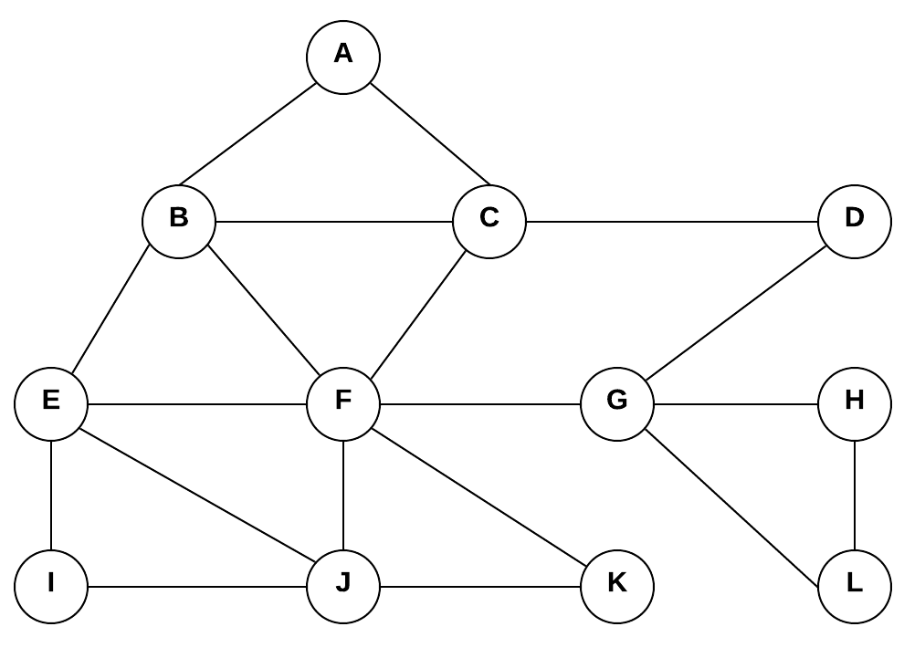

# Teoria dos Grafos

Repositório criado para versionamendo do projeto da disciplina Teoria dos Grafos, ministrada pelo Prof. Adolfo Pinto no primeiro semestre de 2020 na Universidade Tiradentes.

## Requisitos

Para a instalação dos requisitos do projeto abra o promp de comando, navegue até a pasta do projeto e insira o seguinte comando:
```
pip install -r requirements.txt
```

## Inicialização do Programa
Para dar inicio ao programa, execute o arquivo "sistema.py".

Ao abrir o script, você será apresentado com o menu inicial do programa.

## Representação do Grafo
Quando escolher a opção "1 - Definir Grafo" o programa questionará se o mesmo é direcionado (ou digrafo) e, em seguida, se é valorado.
Para estas perguntas, é preciso apenas responder com 1 (para sim) ou 0 (para não).

Então, você será solicitado a informar a quantidade de vértices do grafo e, em seguida, as arestas.

Para a quantidade de vértices, deve-se considerar o primeiro vertice do grafo como vértice '1', e os demais seguindo a ordem numérica ('2', '3', '4', ..., 'n').

Para informar as arestas, deve-se separar os vertices adjacentes por traços e cada par de vertices deve ser separado por virgula (ex.: 1-2, 1-3, 2-3) . Para grafos valorados, separam-se por tracos os vertices iniciais, finais e o peso (ex.: 1-2-10, 1-3-100, 2-3-5).

Por exemplo, para representação do grafo presente na seguinte imagem:



Deve-se entrar:

O grafo é direcionado? Digite 1 para sim ou 0 para não: 
```python
0
```
O grafo é valorado? Digite 1 para sim ou 0 para não: 
```python
0
```
Informe a quantidade de vertices do grafo:
```python
12
```
Informe as arestas do grafo:
```python
1-2, 1-3, 2-3, 2-5, 2-6, 3-4, 3-6, 4-7, 5-6, 5-9, 5-10, 6-7, 6-10, 6-11, 7-8, 7-12, 8-12, 9-10, 10-11
```

Ao final, o programa perguntará se você deseja salvar o grafo para utilizar posteriormente.

Alternativamente, os valores podem ser incluidos diretamente no arquivo "grafos.json", seguindo o padrão dos exemplos no arquivo, e resgatados utilizando a opção "2 - Resgatar Grafo"

## Autores:
* Felipe Carvalho de Gois
* Natália Braga da Fonseca
* Sande Andrade de Souza Costa
